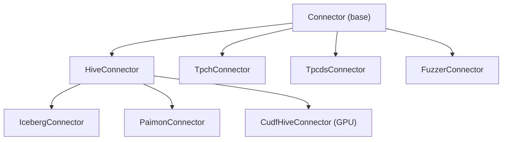

# Velox Connector Coverage Analysis

## Summary Numbers

- **Total Velox core connectors:** 6
- **Total cuDF connectors (experimental):** 1
- **cuDF connectors with core correspondence:** 1 (Hive)
- **Core connectors WITHOUT cuDF counterpart:** 5
- **cuDF coverage:** 1 / 6 = **16.7%**

---

## Velox Core Connectors (6)

All implement `Connector` (or a subclass) + `ConnectorFactory`, registered via `ConnectorRegistry`.

| #   | Connector Name | Class              | Inherits From   | Source Path                      | CMake Target                     |
| --- | -------------- | ------------------ | --------------- | -------------------------------- | -------------------------------- |
| 1   | `"hive"`       | `HiveConnector`    | `Connector`     | `velox/connectors/hive/`         | `velox_hive_connector`           |
| 2   | `"iceberg"`    | `IcebergConnector` | `HiveConnector` | `velox/connectors/hive/iceberg/` | `velox_hive_iceberg_splitreader` |
| 3   | `"paimon"`     | `PaimonConnector`  | `HiveConnector` | `velox/connectors/hive/paimon/`  | `velox_hive_paimon_connector`    |
| 4   | `"tpch"`       | `TpchConnector`    | `Connector`     | `velox/connectors/tpch/`         | `velox_tpch_connector`           |
| 5   | `"tpcds"`      | `TpcdsConnector`   | `Connector`     | `velox/connectors/tpcds/`        | `velox_tpcds_connector`          |
| 6   | `"fuzzer"`     | `FuzzerConnector`  | `Connector`     | `velox/connectors/fuzzer/`       | `velox_fuzzer_connector`         |

**Notes:**

- Iceberg and Paimon are subclasses of HiveConnector (they share Hive's ORC/Parquet I/O but add their own split, metadata, and commit semantics).
- The `hive/storage_adapters/` (S3, HDFS, GCS, ABFS) are **filesystem plugins**, not separate connectors.
- TPC-H and TPC-DS generate synthetic benchmark data in-memory (no external storage).
- Fuzzer generates random data for testing/fuzzing.

---

## cuDF Experimental Connectors (1)

Located under `[velox/experimental/cudf/connectors/](velox/experimental/cudf/connectors/)`.

| #   | cuDF Connector | Class               | Inherits From   | Source Path                                | CMake Target                |
| --- | -------------- | ------------------- | --------------- | ------------------------------------------ | --------------------------- |
| 1   | Hive (cuDF)    | `CudfHiveConnector` | `HiveConnector` | `velox/experimental/cudf/connectors/hive/` | `velox_cudf_hive_connector` |

The `CudfHiveConnectorFactory` extends `HiveConnectorFactory` and overrides `newConnector()` to produce a `CudfHiveConnector` instance that uses cuDF (GPU) for Parquet reads. Key implementation files:

- `CudfHiveConnector.h/.cpp` -- connector and factory
- `CudfHiveDataSource.h/.cpp` -- GPU read path
- `CudfHiveDataSink.h/.cpp` -- GPU write path (WIP/TODO per source comments)
- `CudfHiveTableHandle.h/.cpp` -- table handle
- `CudfHiveConfig.h/.cpp` -- cuDF-specific configuration
- `CudfHiveConnectorSplit.h/.cpp` -- split definitions

---

## Coverage Matrix: cuDF vs. Core Connectors

| #   | Core Connector   | Registered Name | cuDF Counterpart Exists? | cuDF Class          | cuDF Coverage Status                      |
| --- | ---------------- | --------------- | ------------------------ | ------------------- | ----------------------------------------- |
| 1   | HiveConnector    | `"hive"`        | YES                      | `CudfHiveConnector` | Implemented (GPU Parquet read; write WIP) |
| 2   | IcebergConnector | `"iceberg"`     | NO                       | --                  | Not implemented                           |
| 3   | PaimonConnector  | `"paimon"`      | NO                       | --                  | Not implemented                           |
| 4   | TpchConnector    | `"tpch"`        | NO                       | --                  | Not implemented                           |
| 5   | TpcdsConnector   | `"tpcds"`       | NO                       | --                  | Not implemented                           |
| 6   | FuzzerConnector  | `"fuzzer"`      | NO                       | --                  | Not implemented                           |

---

## Verification Checklist (all confirmed from source)

- The `velox/connectors/` directory has exactly 4 top-level connector subdirs: `fuzzer/`, `hive/`, `tpch/`, `tpcds/` (plus `tests/` which is not a connector). Confirmed via `ls -d`.
- Under `hive/`, two sub-connectors exist: `iceberg/` and `paimon/` (each with their own `ConnectorFactory` and registered name). `storage_adapters/` and `benchmarks/` are NOT connectors.
- The `velox/experimental/cudf/connectors/` directory contains exactly one subdirectory: `hive/`. Its `CMakeLists.txt` has only `add_subdirectory(hive)`.
- `CudfHiveConnector` ([CudfHiveConnector.h](velox/experimental/cudf/connectors/hive/CudfHiveConnector.h) line 32) extends `HiveConnector`, and `CudfHiveConnectorFactory` extends `HiveConnectorFactory`.
- No other cuDF connector implementations exist anywhere in `velox/experimental/cudf/`.

---

## Class Hierarchy Diagram

---

## Key Takeaway for Coverage Matrix

Only **1 out of 6** Velox core connectors has a cuDF GPU counterpart. Since Iceberg and Paimon both extend HiveConnector, a cuDF implementation for those could potentially build on `CudfHiveConnector` -- but that work does not exist today. TPC-H, TPC-DS, and Fuzzer are synthetic/in-memory generators where GPU acceleration is less relevant.